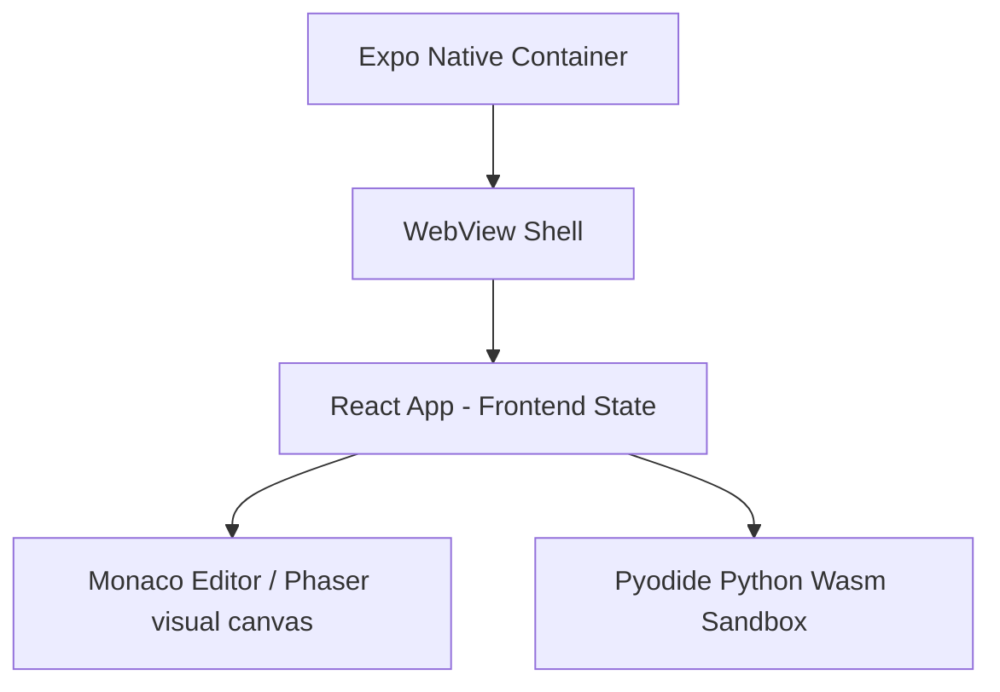

# Architecture Overview: Ronin-v2

This document provides a high-level reconstruction of the Ronin-v2 system architecture, module boundaries, frontend stack, and state systems.

---

## 1. System Architecture

Ronin-v2 is a hybrid educational application structured as a decoupled web application that can be run in desktop browsers or compiled directly into a native Android APK using an Expo-based React Native WebView container.

---

## 2. Frontend Stack & Technologies
* **Core UI Framework**: React (v19) utilizing Vite as the fast build pipeline.
* **Styling**: TailwindCSS combined with Vanilla CSS for deep custom styling controls.
* **Animation**: Framer Motion for premium dialog pop transitions, banners, and overlays.
* **Code Editor**: `@monaco-editor/react` (Monaco Editor) for full keyboard syntax highlighting, editor actions, and code writing.
* **Visual Workspace**: Phaser (v3) for interactive drag-and-drop code blocks with real-time arrow drawing and collision mapping.
* **Sandbox Execution**: `pyodide` compiled to WebAssembly (Wasm) for executing Python code locally on the client's device.

---

## 3. Core Module Boundaries
* **`/src/pages/`**: Application page controllers (`IDETrainingPage.jsx`, `BossTrialGamePage.jsx`, `DashboardPage.jsx`).
* **`/src/features/`**: Feature-specific UI modules (Monaco editors, Phaser Blocks panels, scoreboard dialogs, onboarding views).
* **`/src/game/`**: Game mechanics and scene controllers (`GraphSystemScene.js`, `QuestionEngine.js`).
* **`/src/services/`**: Abstract communication wrappers (`onboardingService.js`, `trainingGroundsService.js`).
* **`/src/content/`**: Local Markdown and JSON assets containing challenges, answers, and visual test definitions.

---

## 4. State Management & Flow
* **Progression State**: Managed through sequential URL slug routing (`IDETrainingPage` parameters) and custom progression state hooks (`currentSeqIndex`).
* **Authentication & Profiles**: Handled by the React `AuthProvider` context and telemetry services.
* **Evaluation Pipeline**: Local state trackers coordinate execution sequences (`submissionCases`, `submissionProgress`, `isRunning`, and `isPassed`) to drive visual checkmarks and error overlays dynamically.
