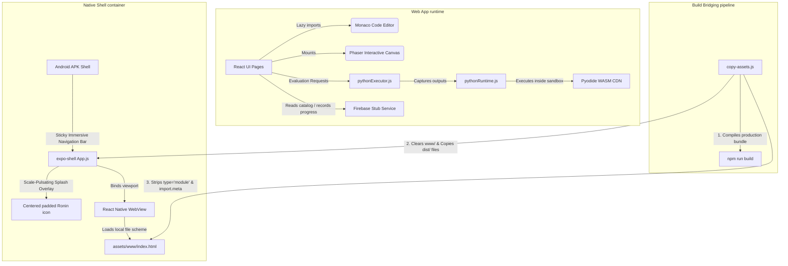

# Ronin-v2 Master Index & Artifact Registry

Welcome to the master index for the Ronin-v2 reconstructed workspace. This directory compiles all system architectures, plans, traces, code modules, and mobile platform layers developed inside the Google Antigravity workspace.

---

## 1. Directory Registry

All generated and extracted artifacts are stored inside the `/artifacts/` workspace folder and organized as follows:

| Path | Format | Description | Status |
| :--- | :--- | :--- | :--- |
| [master_index.md](file:///c:/Users/hadim/VS%20Projects/React%20projects/Ronin-v2/artifacts/master_index.md) | Markdown | Registry Index, application entry points, and build pipeline instructions. | **Active** |
| [architecture_overview.md](file:///c:/Users/hadim/VS%20Projects/React%20projects/Ronin-v2/artifacts/architecture_overview.md) | Markdown | System boundaries, technology stack, and state flows. | **Compiled** |
| [implementation_plans.md](file:///c:/Users/hadim/VS%20Projects/React%20projects/Ronin-v2/artifacts/implementation_plans.md) | Markdown | Implemented diagnostic features, result overlays, and always-clickable submission rules. | **Compiled** |
| [traces.md](file:///c:/Users/hadim/VS%20Projects/React%20projects/Ronin-v2/artifacts/traces.md) | Markdown | Log of agent execution traces, reasoning paths, and resolutions. | **Compiled** |
| [monaco_editor_integration.md](file:///c:/Users/hadim/VS%20Projects/React%20projects/Ronin-v2/artifacts/monaco_editor_integration.md) | Markdown | Monaco editor configurations, event bindings, and WebAssembly evaluations. | **Compiled** |
| [user_flows.md](file:///c:/Users/hadim/VS%20Projects/React%20projects/Ronin-v2/artifacts/user_flows.md) | Markdown | Complete visual journey mapping for both browser and mobile users. | **Compiled** |
| [android_adaptation.md](file:///c:/Users/hadim/VS%20Projects/React%20projects/Ronin-v2/artifacts/android_adaptation.md) | Markdown | Android native sticky navigation, WebAssembly CORS workarounds, and touch layouts. | **Compiled** |
| **`/artifacts/code/`** | Directory | Reorganized core code modules sorted by dependency layers: | **Extracted** |
| ├── [frontend/IDETrainingPage.jsx](file:///c:/Users/hadim/VS%20Projects/React%20projects/Ronin-v2/artifacts/code/frontend/IDETrainingPage.jsx) | React JSX | Main Training Grounds workspace orchestration page. | *Active* |
| ├── [frontend/IDEEditorPanel.jsx](file:///c:/Users/hadim/VS%20Projects/React%20projects/Ronin-v2/artifacts/code/frontend/IDEEditorPanel.jsx) | React JSX | Tabbed code editor container lazily splitting Monaco modules. | *Active* |
| ├── [frontend/MonacoEditorWrapper.jsx](file:///c:/Users/hadim/VS%20Projects/React%20projects/Ronin-v2/artifacts/code/frontend/MonacoEditorWrapper.jsx) | React JSX | Configuration wrapper initializing Monaco IDE parameters. | *Active* |
| ├── [frontend/PhaserBlocksPanel.jsx](file:///c:/Users/hadim/VS%20Projects/React%20projects/Ronin-v2/artifacts/code/frontend/PhaserBlocksPanel.jsx) | React JSX | Interactive visual drag-and-drop code blocks canvas. | *Active* |
| ├── [frontend/LearnMoreDialog.jsx](file:///c:/Users/hadim/VS%20Projects/React%20projects/Ronin-v2/artifacts/code/frontend/LearnMoreDialog.jsx) | React JSX | Technical walkthrough analysis modal for problem dry-runs. | *Active* |
| ├── [backend/firebaseAuth.js](file:///c:/Users/hadim/VS%20Projects/React%20projects/Ronin-v2/artifacts/code/backend/firebaseAuth.js) | JS Stub | Stubbed authentication handler routines. | *Active* |
| ├── [backend/FirebaseService.js](file:///c:/Users/hadim/VS%20Projects/React%20projects/Ronin-v2/artifacts/code/backend/FirebaseService.js) | JS Stub | Stubbed course data and question bank fetching interfaces. | *Active* |
| ├── [agent_pipeline/pythonRuntime.js](file:///c:/Users/hadim/VS%20Projects/React%20projects/Ronin-v2/artifacts/code/agent_pipeline/pythonRuntime.js) | JS Helper | Pyodide WebAssembly compilation and stream-redirection runtime. | *Active* |
| ├── [agent_pipeline/pythonExecutor.js](file:///c:/Users/hadim/VS%20Projects/React%20projects/Ronin-v2/artifacts/code/agent_pipeline/pythonExecutor.js) | JS Helper | Standardized runner executing user code and checking exceptions. | *Active* |
| ├── [agent_pipeline/IDEBlocksRunner.js](file:///c:/Users/hadim/VS%20Projects/React%20projects/Ronin-v2/artifacts/code/agent_pipeline/IDEBlocksRunner.js) | JS Helper | Phaser validation rules, block definitions, and cognitive hints. | *Active* |
| └── [agent_pipeline/copy-assets.js](file:///c:/Users/hadim/VS%20Projects/React%20projects/Ronin-v2/artifacts/code/agent_pipeline/copy-assets.js) | Node Script | Vite compilation, asset copying, and ES module WebView compatibility strippers. | *Active* |

---

## 2. System Entry Points

The entry points for running, compiling, and testing the Ronin-v2 application stack are:

### Web Application Stack
* **Vite HTML Container**: [index.html](file:///c:/Users/hadim/VS%20Projects/React%20projects/Ronin-v2/index.html) (mounts main React app).
* **React Root Mounting**: [src/main.jsx](file:///c:/Users/hadim/VS%20Projects/React%20projects/Ronin-v2/src/main.jsx) (binds page routers, providers, and imports index styles).
* **Router Orchestration**: [src/App.jsx](file:///c:/Users/hadim/VS%20Projects/React%20projects/Ronin-v2/src/App.jsx) (configures paths for dashboards, preferences, and IDE workspaces).

### Mobile Expo Shell
* **Native Root Launch**: [expo-shell/index.js](file:///c:/Users/hadim/VS%20Projects/React%20projects/Ronin-v2/expo-shell/index.js) (loads Expo runtime).
* **App Wrapper & WebView Host**: [expo-shell/App.js](file:///c:/Users/hadim/VS%20Projects/React%20projects/Ronin-v2/expo-shell/App.js) (hosts scale-pulsating splash screen and offline local WebView container).
* **Expo Configuration**: [expo-shell/app.json](file:///c:/Users/hadim/VS%20Projects/React%20projects/Ronin-v2/expo-shell/app.json) (compilation targets, launch icon offsets, and native navigation bar behavior).

### Asset Pipeline Bridger
* **Bridging Orchestrator**: [copy-assets.js](file:///c:/Users/hadim/VS%20Projects/React%20projects/Ronin-v2/copy-assets.js) (compiles Vite and converts output to run offline inside WebViews).

---

## 3. Dependency Graph

The visual mapping of active service layers and compile pipelines is structured as follows:



---

## 4. Build, Run and Packaging Instructions

To build, execute, and package Ronin-v2, run the commands from their respective directories:

### A. Web Application Developer Servers
1. **Install dependencies**:
   ```bash
   npm install
   ```
2. **Launch dev environment (with hot-reload)**:
   ```bash
   npm run dev
   ```
   *Available on [http://localhost:5173](http://localhost:5173)*

### B. Compiling and Bridging Mobile Assets
To update the local offline files for the Expo app after changing frontend code, run the bridge script:
```bash
node copy-assets.js
```
*This compiles the Vite code, copies standard CSS/JS files into `expo-shell/assets/www/`, and transforms files to run without origin errors.*

### C. Expo Mobile Shell Runtimes
1. **Enter shell workspace**:
   ```bash
   cd expo-shell
   ```
2. **Install dependencies**:
   ```bash
   npm install
   ```
3. **Launch Local Expo Go Server (for emulator testing)**:
   ```bash
   npm run android
   ```
4. **Compile Native Preview APK (using Expo Application Services)**:
   ```bash
   npx eas-cli build -p android --profile preview
   ```
   *Compiles a standalone, offline-ready Android APK utilizing immersive navbar and custom launcher settings.*
